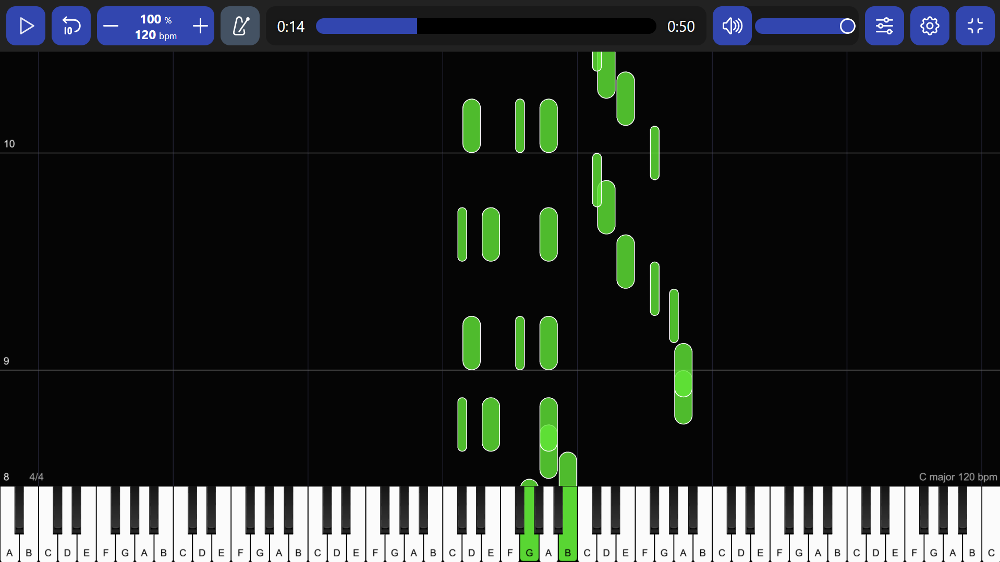

# 🎵 CodeAlpha — Music Generation with AI (Task 3)

An AI that composes new music! A deep **LSTM network** is trained on the classic **Nottingham folk-tunes MIDI dataset** and then generates brand-new note sequences, saved as playable MIDI files. Built for the **CodeAlpha Artificial Intelligence Internship**.

## ✨ Features

- MIDI parsing & preprocessing with **music21** (notes + chords extracted as tokens)
- **2-layer LSTM** network with Embedding layer, trained with early stopping & checkpoints
- **Temperature sampling** — control how "creative" vs "safe" the generated music is
- Generates playable **.mid files** with piano instrument
- Fully configurable pipeline via `config.py`

## 🛠️ Tech Stack

| Component | Technology |
|-----------|------------|
| MIDI processing | music21 |
| Deep Learning | TensorFlow / Keras (LSTM) |
| Dataset | Nottingham folk tunes (1,000+ MIDI files) |

## 📂 Project Structure

```
CodeAlpha_MusicGeneration/
├── config.py         # All settings in one place
├── preprocess.py     # Step 1: MIDI -> note/chord token sequences (notes.pkl)
├── train.py          # Step 2: Train the LSTM model
├── generate.py       # Step 3: Generate new music as MIDI
├── data/midi/        # Dataset goes here
├── model/            # Trained model + vocabulary (created by train.py)
├── output/           # Generated MIDI files (created by generate.py)
└── requirements.txt
```

## 🚀 How to Run

```bash
# 1. Install dependencies
pip install -r requirements.txt

# 2. Preprocess the MIDI dataset
python preprocess.py

# 3. Train the model
python train.py

# 4. Generate new music!
python generate.py
python generate.py --notes 300 --temperature 1.2 --count 3
```

## 📸 Screenshots & Results



**Training summary:**

- Trained on **71,449 sequences** (99-token vocabulary) extracted from **300 Nottingham MIDI files**
- Stacked LSTM reached ~82% training accuracy on next-note prediction over 19 epochs (CPU)
- Model checkpoints saved automatically during training; final model selected via validation loss with early stopping to control overfitting
- 🎧 **Generated MIDI samples are in the `output/` folder** — for a generative model, the real evaluation is how the music sounds, not raw prediction accuracy (many musically-valid "next notes" exist for any sequence)

## 🧠 Model Architecture

```
Input (40 tokens) → Embedding(96) → LSTM(256) → Dropout(0.3)
                  → LSTM(256) → Dropout(0.3) → Dense(vocab) → Softmax
```

The model reads a sliding window of 40 notes/chords and learns to predict the next one — the same idea behind language models, applied to music.

## 📖 Dataset

[Nottingham Music Dataset](https://github.com/jukedeck/nottingham-dataset) — over 1,000 British & Irish folk tunes in MIDI format.

---

*CodeAlpha AI Internship — Task 3 | Repository: `CodeAlpha_MusicGeneration`*
